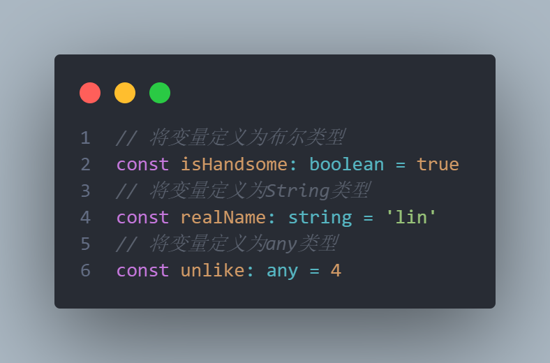
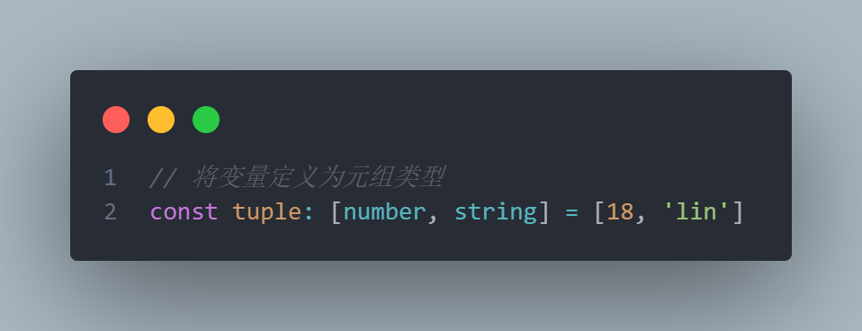
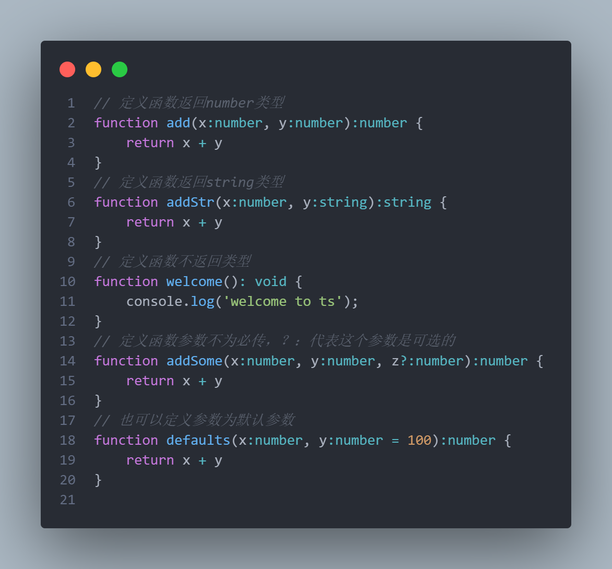
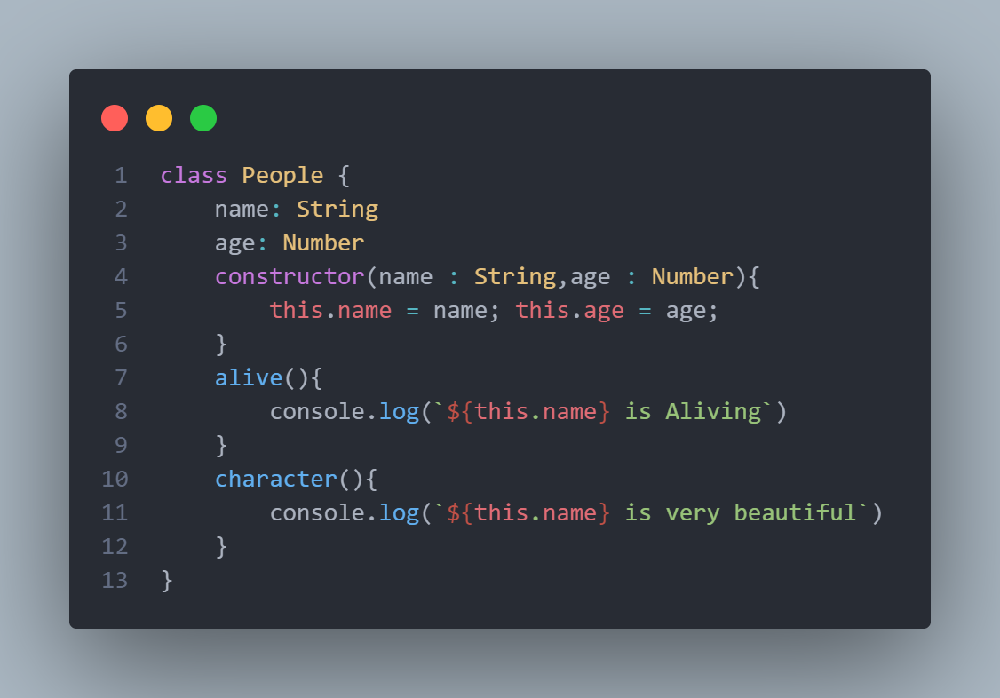
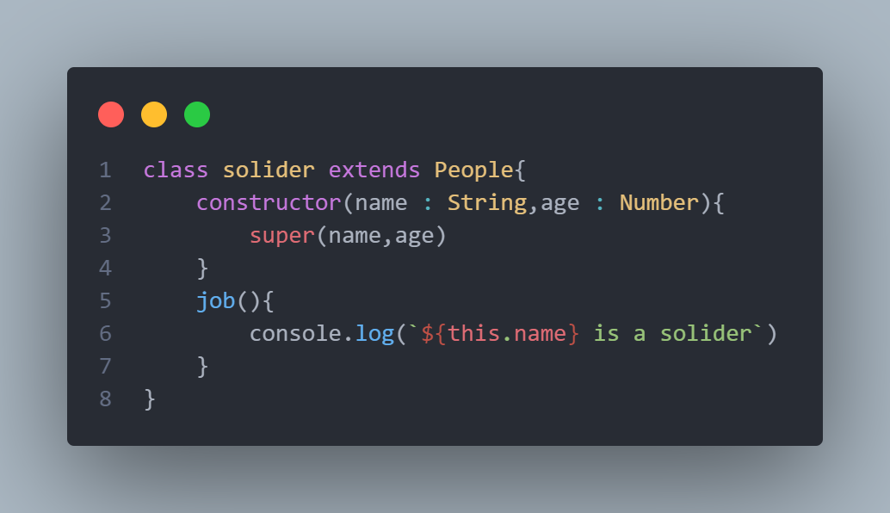
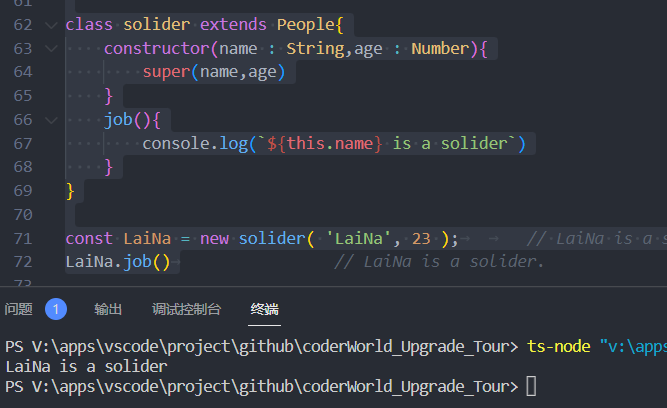
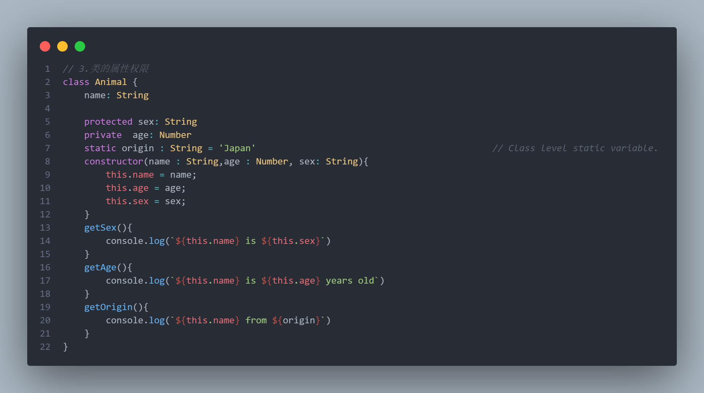
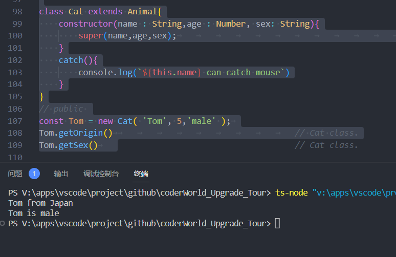
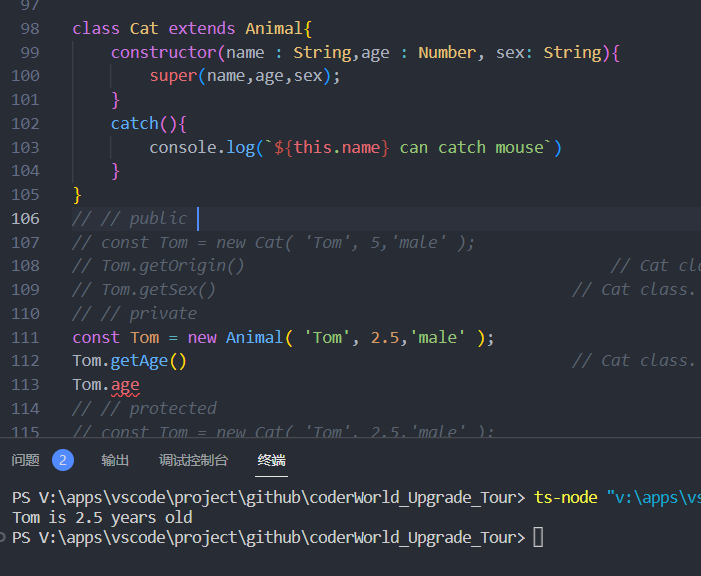
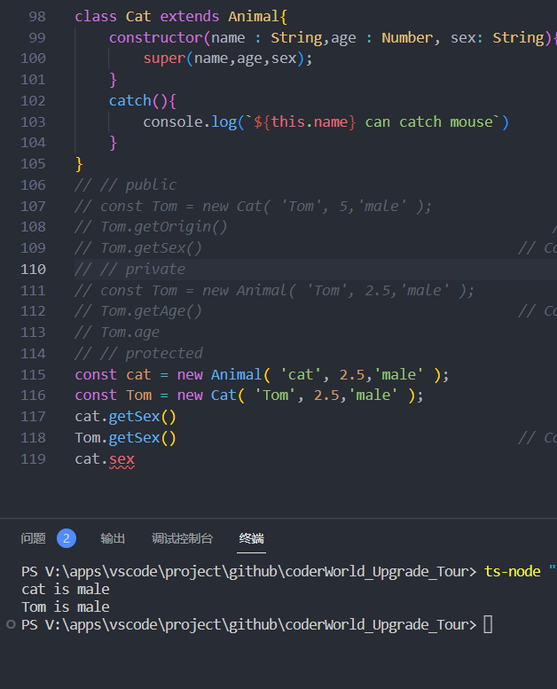

# typescript
# ## 环境搭建

​	在确保电脑中有npm后，可直接安装简易版ts环境。

```
npm install typescript -g
```

​    若不想配置，也可选择 [ts官方playground]( https://www.typescriptlang.org/play?#code/PTAEHUFMBsGMHsC2lQBd5oBYoCoE8AHSAZVgCcBLA1UABWgEM8BzM+AVwDsATAGiwoBnUENANQAd0gAjQRVSQAUCEmYKsTKGYUAbpGF4OY0BoadYKdJMoL+gzAzIoz3UNEiPOofEVKVqAHSKymAAmkYI7NCuqGqcANag8ABmIjQUXrFOKBJMggBcISGgoAC0oACCbvCwDKgU8JkY7p7ehCTkVDQS2E6gnPCxGcwmZqDSTgzxxWWVoASMFmgYkAAeRJTInN3ymj4d-jSCeNsMq-wuoPaOltigAKoASgAywhK7SbGQZIIz5VWCFzSeCrZagNYbChbHaxUDcCjJZLfSDbExIAgUdxkUBIursJzCFJtXydajBBCcQQ0MwAUVWDEQC0gADVHBQGNJ3KAALygABEAAkYNAMOB4GRonzFBTBPB3AERcwABS0+mM9ysygc9wASmCKhwzQ8ZC8iHFzmB7BoXzcZmY7AYzEg-Fg0HUiQ58D0Ii8fLpDKZgj5SWxfPADlQAHJhAA5SASPlBFQAeS+ZHegmdWkgR1QjgUrmkeFATjNOmGWH0KAQiGhwkuNok4uiIgMHGxCyYrA4PCCMpo0nywLlHi8vOSDGgmeljSpYnynHYiGk3x5oAArAAmAAMincR3yx2XcrXxDwx+gSr1M8pNHikDwC6XK+xAB8rqhKJwRu-hy0x-yACM66AVK-aqMW+RiJwxa8gA2gAukAA。)

## 基本语法

### 定义变量

​	ts常用的基本类型为**Boolean**，**String**，**Number**，**Undefined**，**null **，**any**,**unknown**,**void**,比较常用的为**Boolean**，**String**，**Number**，**any**，**void**,而**void**基本用于函数返回值，**any**则不推荐经常使用，大规模使用**any**则违背了ts判断类型的初衷。


​	当变量有可能为多个类型时则可以使用**元组**语法。



​	TS 定义函数类型需要定义**输入参数类型**和**输出类型**。

​	若输出类型为void，也可以不写，如defaults（）。

​	参数后加个问号，则代表这个参数是可选的，如addSome（）。

​	参数后也支持默认参数方式，如defaults（）。



​	TS 定义类基本写法。



​		TS 继承类基本写法。



​	继承类中使用**super**继承父类中的属性。最终可以看到结果输出了 LaiNa is a solider。



​	类中的属性权限等级分别为 **public** **private** **protected**。



​	`public`代表公有的，一个类里**默认**所有的方法和属性都是 **public**。

​	可以看到结果中能输出静态变量**origin**与性别**sex**。



​	`private`代表私有的，**只允许自己访问**，它的实例和继承它的子类都访问不到。

​	可以看到访问类中的getAge方法能直接访问，而直接访问age则会报错。



​	`protected` 代表受保护的，**继承它的子类与自己可以访问**，实例不能访问。

​	可以看到访问Amimal类中的getSex和Cat类中的getSex方法能直接访问，而直接访问sex则会报错。

​	以上则是学习设计模式前需要掌握的ts基础知识。
