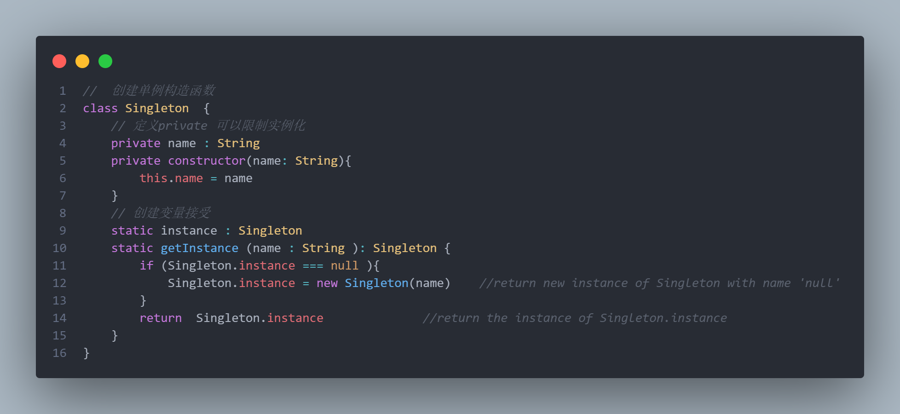

# 前端常用的设计模式

​	以下为前端常用的几种设计模式。


## 工厂模式

​	

## 单例模式

​	单例模式： 为这个类创建一个实例，而后的每次使用都只是**调用**该实例，不再重复创建。

#### 	核心思路

​	*Singleton*类中定义了一个变量 *instance* 用于判断是否创建过该实例。假如未创建过该实例，则新创建一个，假如已经创建过了，则直接调用。

​			

​		可以看见 *诞生于1996* 与 *泰裤辣* 是同一个对象。

​				

#### 	应用场景

​			elementui的**message**组件、jquery的**$**符使用了该思想。

```elementui utils/singeMessage.js
/**重置message，防止重复点击重复弹出message弹框 */
import { Message } from "element-ui";
let messageInstance = null;
let mainMessage = function DoneMessage(options) {
  //如果弹窗已存在先关闭
  if (messageInstance) {
    messageInstance.close();
  }
  messageInstance = Message(options);
}
let arr = ['success', 'warning', 'info', 'error'];
arr.forEach(function (type) {
  mainMessage[type] = function (options) {
    if (typeof options === 'string') {
      options = {
        message: options
      };
    }
    options.type = type;
    return mainMessage(options);
  };
});
export const message = mainMessage;

```


## 原型模式

## 代理模式

## 适配器模式

## 观察者模式

​	观察者模式：每当一个对象状态发生改变时，其相关依赖对象皆得到通知并**被自动更新**。

#### 核心思路

​	可以理解为每个事件有一个**观察者**（subject），有一个**被观察者** （Observer）  当**被观察者发生变化**，观察者就会**主动触发**事件。

​	下图中nbastar充当观察者，Fans充当被观察者。当Fans被添加近fanList时，Fans内部的happy事件会触发。


​	今天是2023-04-25，热火的Bulter拿了56分战胜了雄鹿的坤坤。此役过后，Bulter会多了几个fan1，fans2（创建对象）, 他们希望能拿到Bulter的签名（自动触发sign函数），拿到签名后就会变开心（自动触发happy函数）。


#### 	应用场景

​			js的addEventListener以及其他异步函数。

## 发布订阅模式

​	发布订阅模式：在软件架构中，发布/订阅是一种消息范式，消息的发送者（称为发布者）不会将消息直接发送给特定的接收者（称为订阅者），而是通过消息通道**广播**出去，让订阅该消息主题的订阅者消费到。微信常见的公众号订阅就符合发布订阅思想。

#### 核心思路

​	

#### 	应用场景

​			js的addEventListener以及其他异步函数。

## 迭代器模式

## 其他模式

​	职责链模式

​	策略模式

​	适配器模式


